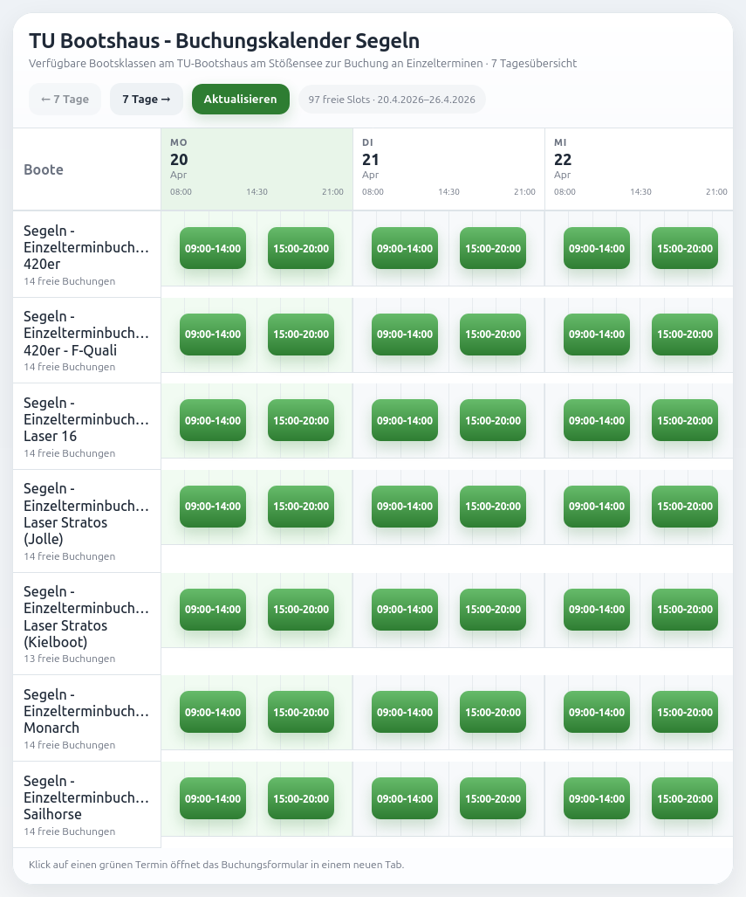

# TU Berlin Bootshaus - Buchungskalender Segeln

Ein kleines Hobbyprojekt, das freie Bootsbuchungen für Segelboote an der TU Berlin einsammelt und als übersichtlichen Kalender darstellt.

Die Idee für das Projekt ist, dass das bestehende [unübersichtliche Buchungssystem](https://www.tu-sport.de/sportprogramm/bootshaus/bootsverleih/) der TU könnte einen grafischen Kalender vertragen könnte.

Hier entlang zum Ausprobieren: https://tllsngnzlz.github.io/tu-boat-worker/

## Architektur

Das Projekt besteht aus zwei Teilen:

- **Frontend**: statische Website mit Kalenderansicht im Ordner /docs
- **Worker**: crawlt die TU-Seiten, findet aktuelle Buchungslinks und liefert normalisierte Slot-Daten als JSON

## Ablauf

1. Der Worker startet auf der [Bootshaus-Seite](https://www.tu-sport.de/sportprogramm/bootshaus/).
2. Er findet den Link zu [Bootsverleih](https://www.tu-sport.de/sportprogramm/bootshaus/bootsverleih/).
3. Von dort folgt er zur Bootsübersicht / Buchung.
4. Er sammelt alle aktuellen Bootskategorie-Seiten.
5. Pro Kategorie findet er die saisonalen Buchungslinks.
6. Er lädt die finalen Buchungsseiten mit freien Terminen.
7. Er extrahiert verfügbare Slots.
8. Das Frontend lädt diese Daten und rendert den Kalender.

## Features

- Stellt freie Buchungen dar
- Ergebnisse des Crawling werden 5 Minuten gecached
- 7-Tage-Kalender mit Blätterfunktion
- Klick auf Slot öffnet die TU-Buchung in neuem Tab

## ToDo

- Schöneres Layout
- Caching überarbeiten
- Code aufräumen
- How To deploy/run locally

## Lizenz

GPL 3 Lizenz